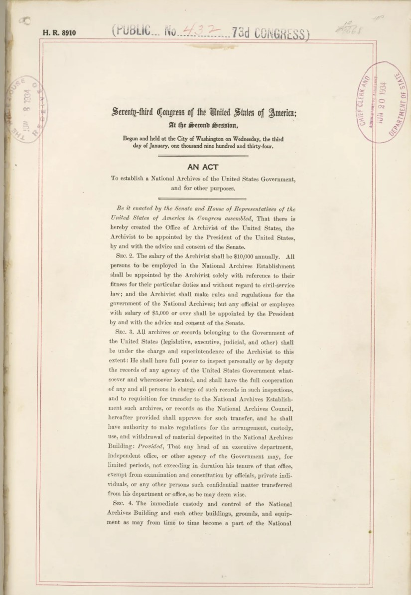
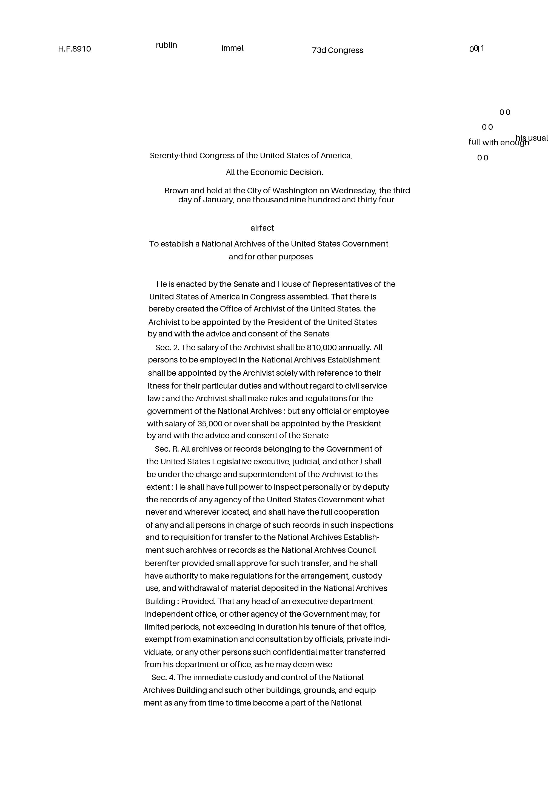

# OCRD Project

## Description
This is a demo project for "Optical Character Recognition Digitization" of full text pages. It is designed for use as a Hugging Face Gradio app. 

The underlying processing pipeline includes:
  1. Image binarization
  2. Text line segmentation
  3. Text line extraction, filtering, and deskewing
  4. OCR on text lines
  5. Printing recognized text on generated image for visualization

Please note:
- The app is optimized for **English**; other languages (e.g., German) may require OCR model fine-tuning.
- When running on CPUs, a pipeline run can take up to 10 minutes.
- For lengthy waits or if the online app is down, look at the pre-computed examples: [https://github.com/pluniak/ocrd/tree/main/data/demo_data](https://github.com/pluniak/ocrd/tree/main/data/demo_data)
- The demo is just a **first prototype**! OCR performance and computation speed should be optimized.

Usage:
  1. Try out the the demo online at https://huggingface.co/spaces/pluniak/ocrd
  2. or follow the steps below to install and run the app on your local computer.

## Installation
  1. Install Anaconda if you haven't done yet: https://docs.anaconda.com/free/anaconda/install
  2. From CLI clone this repository and set up and activate the virtual environment:
```bash
git clone https://github.com/pluniak/ocrd.git
cd ocrd
./create_conda_env_linux.sh # Linux
create_conda_env_windows.bat # Windows (using Conda terminal)
conda activate ocrd
```

## Run app locally
After activating the virtual environment, you can run the app locally as a Web Server or inside a Jupyter Notebook.
### Web Server
Execute this script from CLI:
```bash
python ./src/app.py
```
### Jupyter Notebook
Open and run this notebook:
```bash
./notebooks/app.ipynb
```

## OCRD Pipeline Demo

### Input and Output Images

<div style="display: flex; justify-content: center; align-items: center;">
  <figure style="margin: 10px; text-align: center;">
    <figcaption>Input Image</figcaption>
    
  </figure>
  <figure style="margin: 10px; text-align: center;">
    <figcaption>Output Image</figcaption>
    
  </figure>
</div>


## Acknowledgements and Attributions

This project makes use of significant components from the following open-source projects:

- **eynollah**: An automated layout analysis tool for historical documents, developed as part of the QURATOR project. The eynollah tool is instrumental in facilitating the preprocessing of document images in this project. For more details on eynollah, visit their GitHub repository: [qurator-spk/eynollah](https://github.com/qurator-spk/eynollah). The tool is used under the Apache License 2.0.

- **Microsoft trocr**: I utilize Microsoft's trocr models for optical character recognition tasks. The trocr models are highly effective in recognizing text from a variety of document types. For more information on trocr and its usage, please see [Microsoft's trocr repository](https://github.com/microsoft/unilm) under the MIT License.

I appreciate the efforts of the developers and the community in providing these high-quality open-source resources.
